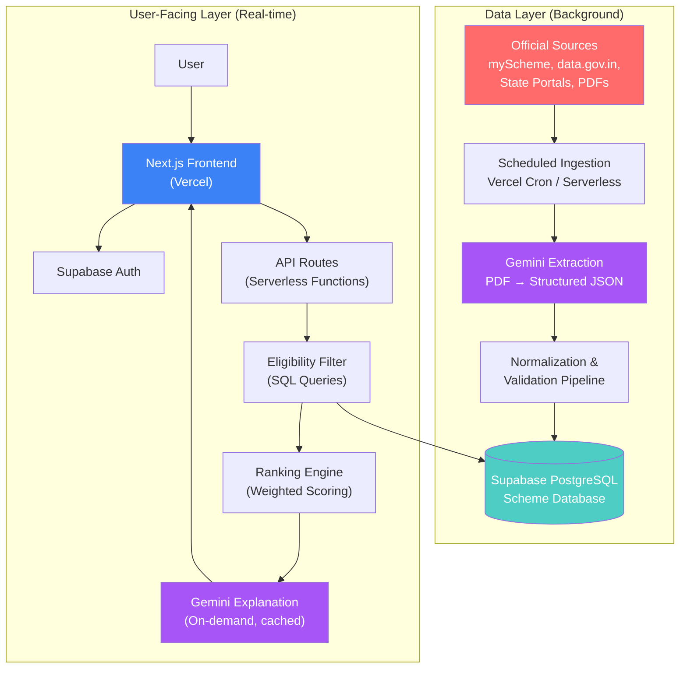
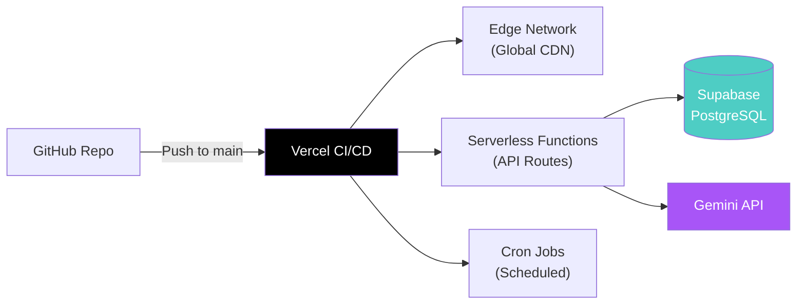
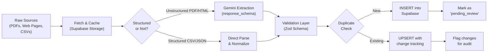
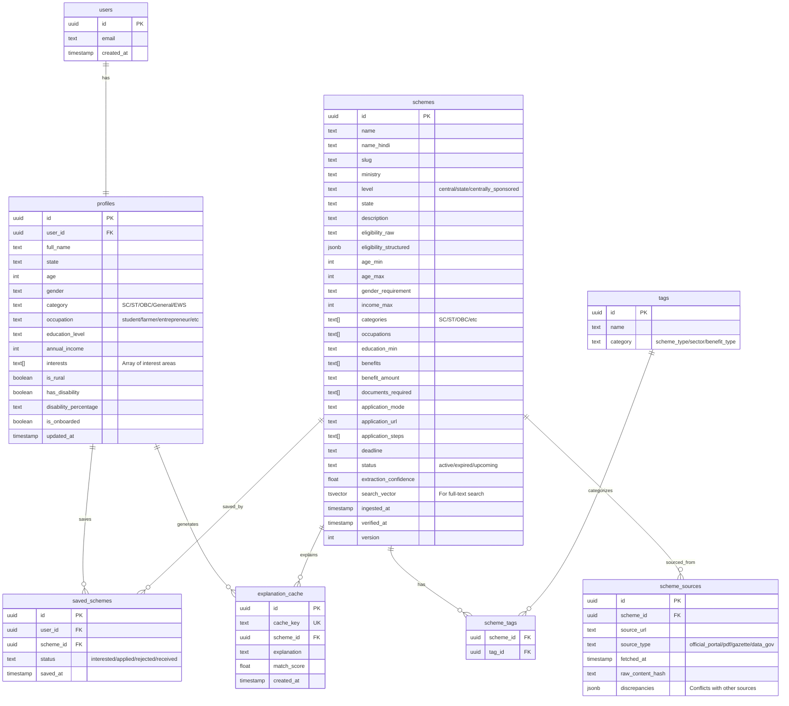
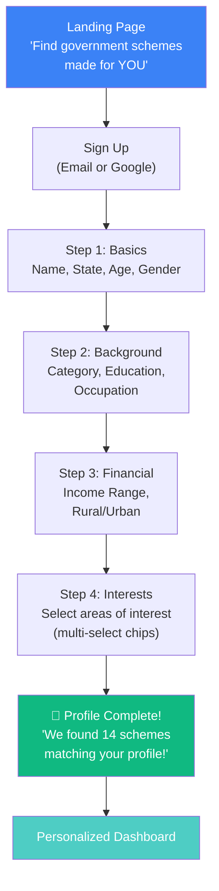
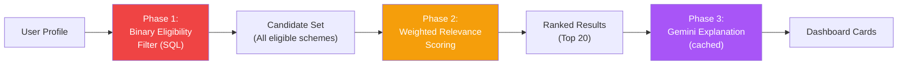
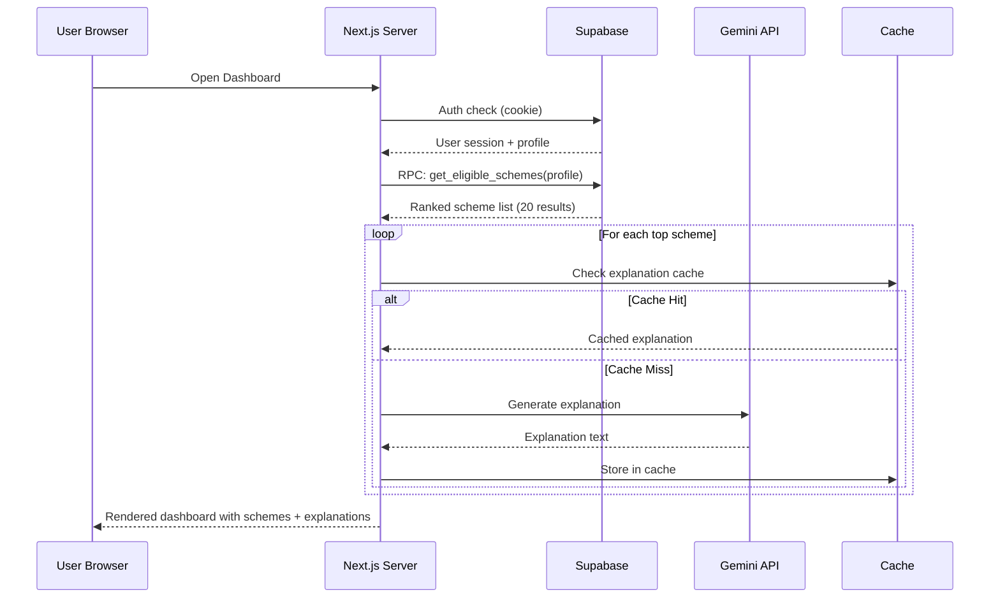
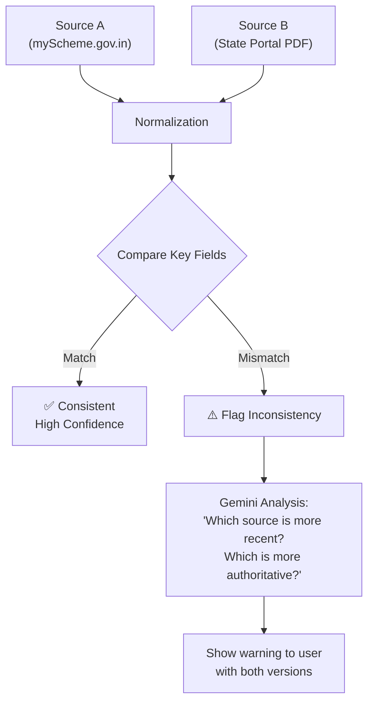
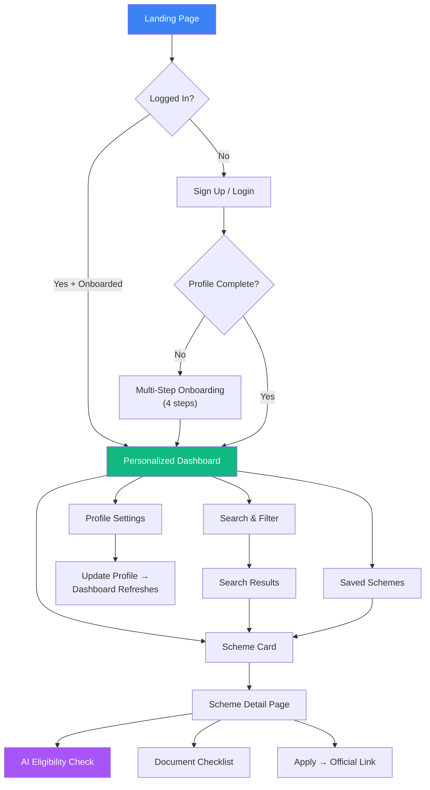

# SoochAI — Architecture Research & Execution Blueprint

> **"Don't make citizens search through hundreds of government schemes. SoochAI automatically finds the schemes relevant to you, explains why you may qualify, and tells you what to do next."**

---

## 1. Problem Statement

India has **thousands of active government schemes** spanning Central Sector, Centrally Sponsored, and State-specific programs across categories like agriculture, education, health, housing, entrepreneurship, social welfare, and more. Despite the existence of portals like [myScheme.gov.in](https://www.myscheme.gov.in), citizens face critical barriers:

| Barrier | Impact |
|:---|:---|
| **Information overload** | Thousands of schemes across 30+ ministries and 28+ states |
| **Fragmented sources** | Scheme details scattered across ministry PDFs, state portals, gazette notifications |
| **Eligibility confusion** | Complex, ambiguous language in eligibility criteria |
| **No proactive matching** | Citizens must manually search; no system "pushes" relevant schemes to them |
| **Stale/conflicting data** | Different portals show conflicting deadlines, benefits, or eligibility for the same scheme |
| **Language barriers** | Most official documents are in English/Hindi; regional language support is minimal |

### Final Problem Statement

> Millions of eligible Indian citizens miss out on government benefits — not because they don't qualify, but because they don't know what exists, can't parse eligibility criteria, or get lost navigating fragmented portals. SoochAI solves this by building a **personalized, AI-powered discovery engine** that automatically matches users to relevant schemes, explains eligibility in plain language, and provides actionable next steps — all from a single dashboard.

---

## 2. Target Users & Use Cases

### Primary User Segments

| Segment | Key Need | Example |
|:---|:---|:---|
| **Students** | Scholarships, education grants, book subsidies | 19-year-old SC student looking for post-matric scholarships |
| **Job Seekers** | Employment schemes, skill development, unemployment allowance | Graduate from Bihar seeking PMKVY or state employment schemes |
| **Farmers** | Crop insurance, subsidies, equipment grants, PM-KISAN | Small farmer in Maharashtra wanting to know about PM-KISAN, crop insurance |
| **Women** | Maternity benefits, SHG support, women entrepreneurship | Woman in rural UP checking eligibility for PMMY, Ujjwala |
| **Entrepreneurs/MSMEs** | Startup grants, MUDRA loans, MSME subsidies | First-generation entrepreneur exploring Stand-Up India |
| **Senior Citizens** | Pension schemes, health insurance, social security | 62-year-old retiree checking Atal Pension Yojana eligibility |
| **Persons with Disabilities** | Disability-specific welfare, assistive tech, education support | Person with 40%+ disability seeking ADIP scheme |
| **Low-Income Families** | BPL benefits, housing (PMAY), ration card schemes | Family below poverty line in Jharkhand |

### Use Cases

1. **Profile-based auto-discovery** — "Show me all schemes I qualify for"
2. **Manual search & filter** — "Find all scholarships in Maharashtra for SC students"
3. **Eligibility check** — "Am I eligible for PM-KISAN? Why or why not?"
4. **Document checklist** — "What documents do I need for PMAY application?"
5. **Scheme comparison** — "Compare these 3 scholarship schemes side-by-side"
6. **Status/freshness check** — "Is this scheme still active? When is the deadline?"

---

## 3. MVP vs Advanced Features

### MVP (Hackathon Scope — 48-72 hours)

| Feature | Priority | Notes |
|:---|:---|:---|
| User profile creation (state, age, occupation, education, income, gender, category) | 🔴 Critical | Multi-step onboarding form |
| Curated scheme database (50–100 popular/impactful schemes) | 🔴 Critical | Pre-seeded, not scraped live |
| Deterministic eligibility filtering & ranking | 🔴 Critical | SQL-based, not AI-based |
| Personalized dashboard with match scores | 🔴 Critical | "12 schemes matched to your profile" |
| Gemini-powered "Why this matches you" explanation | 🔴 Critical | The AI differentiator |
| Scheme detail page (all 10 required fields) | 🔴 Critical | What, Who, Eligibility, Documents, etc. |
| Search & filter interface | 🟡 Important | By state, category, scheme type |
| Supabase Auth (email/Google login) | 🟡 Important | Profile persistence |
| Mobile-responsive UI | 🟡 Important | Most Indian users access via mobile |

### Advanced Features (Post-Hackathon)

| Feature | Description |
|:---|:---|
| **Automated ingestion pipeline** | Scheduled scraping/parsing of myScheme, data.gov.in |
| **Gemini PDF extraction** | Parse official government PDFs/gazettes into structured data |
| **Multi-language support** | Hindi, regional languages via Bhashini or Gemini translation |
| **Document readiness tracker** | "You have 4/6 required documents ready" |
| **Scheme alerts/notifications** | "New scheme matching your profile!" or "Deadline in 5 days" |
| **Chatbot interface** | Conversational eligibility checking (WhatsApp integration like Jugalbandi) |
| **Scheme comparison tool** | Side-by-side comparison of similar schemes |
| **Inconsistency detection** | Flag conflicting info across official sources |
| **Crowdsourced verification** | Users report outdated/incorrect scheme info |
| **Application tracking** | Track application status across schemes |

---

## 4. USPs & Differentiators

### What makes SoochAI different from myScheme.gov.in or basic scheme lists?

| Differentiator | Description |
|:---|:---|
| 🎯 **Proactive, not reactive** | Dashboard auto-shows relevant schemes on login — no manual search required |
| 🤖 **AI-powered explanations** | Gemini explains *why* you qualify (or don't) in plain, human-readable language |
| 📊 **Match scoring** | Quantified relevance score (0–100%) so users prioritize highest-value schemes |
| 🔍 **Eligibility clarity** | Gemini interprets ambiguous bureaucratic language into clear yes/no eligibility |
| ⚠️ **Inconsistency detection** | Flags when different official sources show conflicting information |
| 📋 **Document checklist** | Actionable list of documents needed, per scheme, per user |
| 🏗️ **Structured + AI hybrid** | Deterministic filtering for speed & accuracy + AI for nuance & explanation |
| 📱 **Mobile-first** | Designed for India's mobile-dominant internet population |

### The "Why Not Just Use ChatGPT?" Defense

> ChatGPT/generic chatbots hallucinate scheme details, can't guarantee up-to-date information, and don't maintain a verified database. SoochAI uses a **curated, structured database** for accuracy and **Gemini only for explanation and extraction** — never as the source of truth for scheme data.

---

## 5. System Architecture

### High-Level Architecture Diagram



### Two-Path Architecture Principle

> [!IMPORTANT]
> The system has **two completely separate data paths** that must not be confused:

| Path | Frequency | Latency Requirement | Uses Gemini? |
|:---|:---|:---|:---|
| **Background Ingestion** | Daily/weekly cron | Minutes acceptable | ✅ For extraction from PDFs |
| **User Dashboard** | Every page load | < 2 seconds | ✅ Only for explanation (cached) |

**Critical Rule:** The user-facing dashboard **NEVER** scrapes websites or performs heavy Gemini extraction. It queries the **already-normalized database** and optionally calls Gemini for explanation text (which is then cached).

---

## 6. Serverless Architecture & Deployment Strategy

### Stack Decision

| Component | Technology | Rationale |
|:---|:---|:---|
| **Frontend + SSR** | Next.js (App Router) | Server Components, Server Actions, middleware for auth |
| **Hosting** | Vercel | Zero-config deployment, edge functions, built-in cron |
| **Database** | Supabase (PostgreSQL) | Free tier generous, RLS, full-text search, pgvector |
| **Auth** | Supabase Auth | Email/Google OAuth, session management, free tier |
| **AI** | Gemini API (latest Flash model) | Structured output, PDF processing, cost-effective |
| **Cron/Background** | Vercel Cron Jobs | `vercel.json` config, triggers API routes on schedule |
| **File Storage** | Supabase Storage | For cached PDFs, user documents (future) |

### Vercel Cron Configuration

```json
// vercel.json
{
  "crons": [
    {
      "path": "/api/cron/ingest-schemes",
      "schedule": "0 2 * * 1"  // Weekly on Monday at 2 AM UTC
    },
    {
      "path": "/api/cron/validate-schemes",
      "schedule": "0 6 * * *"  // Daily at 6 AM UTC - check for stale data
    }
  ]
}
```

> [!WARNING]
> **Vercel Cron Limitations:**
> - Free tier: max 2 cron jobs, daily frequency minimum
> - Pro tier: up to 40 cron jobs, every-minute frequency
> - Serverless function timeout: 15 minutes (Pro), 10 seconds (Hobby)
> - **Mitigation:** For hackathon MVP, pre-seed the database manually. Cron is for demo/future use.

### Deployment Architecture



---

## 7. Data Collection & Official-Source Pipeline

### Data Sources (Prioritized for MVP)

| Source | Type | Access Method | Data Quality |
|:---|:---|:---|:---|
| **Kaggle datasets** (Indian Govt Schemes) | Pre-structured CSV/JSON | Direct download | ⭐⭐⭐ Good starting point |
| **data.gov.in** | Official API | REST API (API key required) | ⭐⭐⭐⭐ Official but sparse |
| **myScheme.gov.in** | Web portal | Manual curation (no public API) | ⭐⭐⭐⭐⭐ Most comprehensive |
| **State portal PDFs** | Unstructured documents | Manual download → Gemini extraction | ⭐⭐ Varies wildly |
| **India.gov.in** | Directory/links | Manual reference | ⭐⭐⭐ Good for cross-referencing |

### MVP Data Strategy

> [!TIP]
> **For the hackathon, DO NOT build a scraper.** Instead:
> 1. Download a Kaggle dataset of Indian government schemes
> 2. Manually curate 50–100 popular, high-impact schemes
> 3. Use Gemini to enrich/normalize the data into your schema
> 4. Pre-seed the Supabase database
> 5. Demo the *architecture* for automated ingestion (show the cron, show the extraction pipeline)

### Ingestion Pipeline (Production Architecture)



### Gemini Extraction Schema (TypeScript/Zod)

```typescript
import { z } from 'zod';

// This schema is passed to Gemini's response_schema for structured extraction
export const SchemeExtractionSchema = z.object({
  name: z.string().describe("Official name of the government scheme"),
  name_hindi: z.string().optional().describe("Hindi name if available"),
  ministry: z.string().describe("Issuing ministry or department"),
  level: z.enum(["central", "state", "centrally_sponsored"]),
  state: z.string().optional().describe("State, if state-specific scheme"),
  
  description: z.string().describe("2-3 sentence plain-language summary"),
  
  eligibility: z.object({
    age_min: z.number().optional(),
    age_max: z.number().optional(),
    gender: z.enum(["all", "male", "female", "transgender"]).optional(),
    income_max: z.number().optional().describe("Maximum annual income in INR"),
    categories: z.array(z.string()).describe("SC, ST, OBC, General, EWS, etc."),
    occupations: z.array(z.string()).describe("student, farmer, entrepreneur, etc."),
    education_min: z.string().optional().describe("Minimum education level"),
    residency: z.string().optional().describe("Residency requirements"),
    raw_text: z.string().describe("Original eligibility text verbatim"),
  }),
  
  benefits: z.array(z.string()).describe("List of specific benefits"),
  benefit_amount: z.string().optional().describe("Financial benefit amount if applicable"),
  
  documents_required: z.array(z.string()),
  
  application: z.object({
    mode: z.enum(["online", "offline", "both"]),
    url: z.string().optional().describe("Official application URL"),
    procedure: z.array(z.string()).describe("Step-by-step application process"),
  }),
  
  deadline: z.string().optional().describe("Application deadline or 'ongoing'"),
  status: z.enum(["active", "expired", "upcoming", "unknown"]),
  
  source_url: z.string().describe("URL of the source document"),
  extraction_confidence: z.number().min(0).max(1).describe("Model's confidence in extraction accuracy"),
});
```

---

## 8. Gemini API Integration Strategy

### Where Gemini is Used (and Where It's NOT)

| Task | Uses Gemini? | Rationale |
|:---|:---|:---|
| Eligibility filtering | ❌ No | Deterministic SQL query — faster, cheaper, reliable |
| Match score calculation | ❌ No | Weighted algorithm in SQL — deterministic |
| Scheme search | ❌ No | PostgreSQL full-text search + filters |
| Dashboard rendering | ❌ No | React components + database query |
| **PDF/document extraction** | ✅ Yes | Gemini excels at understanding unstructured documents |
| **Eligibility language parsing** | ✅ Yes | Interpreting ambiguous bureaucratic eligibility text |
| **"Why this matches you" explanation** | ✅ Yes | Personalized, human-readable explanation |
| **Inconsistency detection** | ✅ Yes | Cross-referencing data from multiple sources |
| **Scheme classification/tagging** | ✅ Yes | Auto-categorizing schemes into taxonomy |

### Gemini Usage Patterns

#### Pattern 1: Background Extraction (Cron Job)
```
Trigger: Vercel Cron → /api/cron/ingest-schemes
Input: Raw PDF or HTML content
Model: gemini-flash (latest available)
Config: response_schema = SchemeExtractionSchema, temperature = 0
Output: Structured JSON → validated → INSERT into Supabase
Frequency: Weekly
Cost: Low (batch processing, flash model)
```

#### Pattern 2: On-Demand Explanation (User Request)
```
Trigger: User opens scheme detail page
Input: {scheme structured data} + {user profile}
Model: gemini-flash (latest available)
Prompt: "Explain why this scheme matches this user profile. Be specific about
         which eligibility criteria they meet. If any criteria are ambiguous,
         explain the uncertainty. Keep it under 150 words."
Config: temperature = 0.3, max_tokens = 300
Output: Explanation text → cached in database for 24 hours
Cost: Very low (short output, flash model, cached)
```

#### Pattern 3: Eligibility Interpretation (Background)
```
Trigger: New scheme ingested
Input: Raw eligibility text from official source
Model: gemini-flash (latest available)
Prompt: "Parse this eligibility criteria into structured boolean conditions.
         Flag any ambiguous terms."
Output: Structured eligibility rules + ambiguity flags
Frequency: Per-scheme (one-time, on ingestion)
```

### Caching Strategy for Gemini Calls

> [!IMPORTANT]
> **Never call Gemini on every dashboard load.** Cache aggressively:

| Explanation Type | Cache Duration | Cache Key |
|:---|:---|:---|
| "Why this matches you" | 24 hours | `scheme_id + user_profile_hash` |
| Scheme summary | 7 days | `scheme_id` |
| Eligibility interpretation | Until scheme data changes | `scheme_id + data_version` |

```typescript
// Pseudocode for cached Gemini explanation
async function getSchemeExplanation(schemeId: string, userProfile: UserProfile) {
  const cacheKey = `explanation:${schemeId}:${hashProfile(userProfile)}`;
  
  // Check cache first
  const cached = await supabase
    .from('explanation_cache')
    .select('explanation, created_at')
    .eq('cache_key', cacheKey)
    .gte('created_at', new Date(Date.now() - 24 * 60 * 60 * 1000).toISOString())
    .single();
  
  if (cached.data) return cached.data.explanation;
  
  // Cache miss — call Gemini
  const explanation = await gemini.generateContent({
    model: "gemini-flash-latest",
    contents: buildExplanationPrompt(scheme, userProfile),
    config: { temperature: 0.3, maxOutputTokens: 300 }
  });
  
  // Store in cache
  await supabase.from('explanation_cache').upsert({
    cache_key: cacheKey,
    scheme_id: schemeId,
    explanation: explanation.text,
    created_at: new Date().toISOString(),
  });
  
  return explanation.text;
}
```

### Gemini API Risk Mitigation

| Risk | Impact | Mitigation |
|:---|:---|:---|
| Rate limiting | Dashboard breaks under load | Cache all Gemini responses; never call on every page load |
| Model deprecation | API calls fail | Use model alias (e.g., `gemini-flash-latest`); check current models before hackathon |
| Hallucinated scheme data | Users get wrong information | Gemini NEVER generates scheme data — only explains pre-verified database records |
| Cost overrun | Budget exceeded | Flash model + caching + batch processing keeps costs minimal |
| Latency spikes | Slow dashboard | Pre-compute explanations in background; serve from cache |
| Free tier limits | Blocked during demo | Test quota before demo; have paid API key as backup |

---

## 9. Database Schema Design

### Entity-Relationship Diagram



### Key SQL Indexes

```sql
-- Full-text search on scheme name and description
CREATE INDEX idx_schemes_search ON schemes USING GIN(search_vector);

-- Eligibility filtering indexes (critical for dashboard performance)
CREATE INDEX idx_schemes_state ON schemes(state);
CREATE INDEX idx_schemes_status ON schemes(status);
CREATE INDEX idx_schemes_level ON schemes(level);
CREATE INDEX idx_schemes_age ON schemes(age_min, age_max);
CREATE INDEX idx_schemes_income ON schemes(income_max);
CREATE INDEX idx_schemes_categories ON schemes USING GIN(categories);
CREATE INDEX idx_schemes_occupations ON schemes USING GIN(occupations);

-- Auto-update search vector on insert/update
CREATE OR REPLACE FUNCTION update_search_vector()
RETURNS TRIGGER AS $$
BEGIN
  NEW.search_vector := 
    setweight(to_tsvector('english', COALESCE(NEW.name, '')), 'A') ||
    setweight(to_tsvector('english', COALESCE(NEW.description, '')), 'B') ||
    setweight(to_tsvector('english', COALESCE(NEW.ministry, '')), 'C') ||
    setweight(to_tsvector('english', COALESCE(NEW.eligibility_raw, '')), 'D');
  RETURN NEW;
END;
$$ LANGUAGE plpgsql;

CREATE TRIGGER schemes_search_vector_update
  BEFORE INSERT OR UPDATE ON schemes
  FOR EACH ROW EXECUTE FUNCTION update_search_vector();
```

### Row Level Security Policies

```sql
-- Users can only read their own profile
CREATE POLICY "Users view own profile" ON profiles
  FOR SELECT USING (auth.uid() = user_id);

-- Users can only update their own profile
CREATE POLICY "Users update own profile" ON profiles
  FOR UPDATE USING (auth.uid() = user_id);

-- All authenticated users can read schemes (public data)
CREATE POLICY "Authenticated users read schemes" ON schemes
  FOR SELECT TO authenticated USING (true);

-- Users can only manage their own saved schemes
CREATE POLICY "Users manage own saved schemes" ON saved_schemes
  FOR ALL USING (auth.uid() = user_id);
```

---

## 10. User Onboarding & Profile Design

### Onboarding Flow



### Profile Fields (MVP)

| Field | Type | Input UI | Required? | Used For |
|:---|:---|:---|:---|:---|
| **State** | Enum (28 states + 8 UTs) | Dropdown/searchable select | ✅ | State-specific scheme filtering |
| **Age** | Integer | Date picker → calculated | ✅ | Age-range eligibility |
| **Gender** | Enum | Radio buttons | ✅ | Gender-specific schemes |
| **Category** | Enum | Dropdown (General/SC/ST/OBC/EWS) | ✅ | Category-based eligibility |
| **Occupation** | Enum | Chips/select | ✅ | Occupation-specific schemes |
| **Education** | Enum | Dropdown (levels) | ✅ | Education-based filtering |
| **Annual Income** | Range | Slider or range brackets | ✅ | Income-cap eligibility |
| **Interests** | Multi-select | Chip/tag selector | ⬜ | Relevance ranking boost |
| **Rural/Urban** | Boolean | Toggle | ⬜ | Rural-specific schemes |
| **Has Disability** | Boolean | Toggle | ⬜ | Disability schemes |

### Design Principles for Onboarding

> [!TIP]
> - **Never ask more than 4-5 fields per step** — reduce cognitive load
> - **Show progress bar** — "Step 2 of 4"
> - **Allow "Prefer not to say"** for sensitive fields (category, income)
> - **Explain WHY each field matters** — "We ask your state to find state-specific schemes"
> - **Save progress server-side** — user can resume if they drop off
> - **Show instant payoff** — After completion, immediately show matched scheme count

---

## 11. Eligibility Matching & Ranking Logic

### Two-Phase Matching Architecture



### Phase 1: Binary Eligibility Filter (SQL)

Hard filters that exclude schemes the user definitely cannot access:

```sql
-- Core eligibility query (executed as a Supabase RPC function)
CREATE OR REPLACE FUNCTION get_eligible_schemes(
  p_state TEXT,
  p_age INTEGER,
  p_gender TEXT,
  p_category TEXT,
  p_occupation TEXT,
  p_education TEXT,
  p_income INTEGER
)
RETURNS TABLE (
  scheme_id UUID,
  name TEXT,
  description TEXT,
  benefits TEXT[],
  match_score FLOAT
) AS $$
BEGIN
  RETURN QUERY
  SELECT 
    s.id AS scheme_id,
    s.name,
    s.description,
    s.benefits,
    -- Phase 2: Weighted scoring inline
    (
      -- State match (weight: 0.25)
      (CASE 
        WHEN s.state IS NULL OR s.state = p_state THEN 1.0
        WHEN s.level = 'central' THEN 0.8
        ELSE 0.0
      END * 0.25) +
      
      -- Category match (weight: 0.20)
      (CASE 
        WHEN p_category = ANY(s.categories) THEN 1.0
        WHEN 'General' = ANY(s.categories) THEN 0.5
        ELSE 0.3
      END * 0.20) +
      
      -- Occupation match (weight: 0.20)
      (CASE 
        WHEN p_occupation = ANY(s.occupations) THEN 1.0
        ELSE 0.2
      END * 0.20) +
      
      -- Income proximity (weight: 0.15)
      (CASE 
        WHEN s.income_max IS NULL THEN 0.5
        WHEN p_income <= s.income_max THEN 1.0
        WHEN p_income <= s.income_max * 1.1 THEN 0.3  -- Close to limit
        ELSE 0.0
      END * 0.15) +
      
      -- Benefit value signal (weight: 0.10)
      (CASE 
        WHEN s.benefit_amount IS NOT NULL THEN 0.8
        ELSE 0.4
      END * 0.10) +
      
      -- Freshness/status (weight: 0.10)
      (CASE 
        WHEN s.status = 'active' THEN 1.0
        WHEN s.status = 'upcoming' THEN 0.7
        ELSE 0.1
      END * 0.10)
    ) AS match_score
  FROM schemes s
  WHERE 
    -- Hard eligibility filters
    s.status IN ('active', 'upcoming')
    AND (s.state IS NULL OR s.state = p_state OR s.level = 'central')
    AND (s.age_min IS NULL OR p_age >= s.age_min)
    AND (s.age_max IS NULL OR p_age <= s.age_max)
    AND (s.gender_requirement IS NULL OR s.gender_requirement = 'all' OR s.gender_requirement = p_gender)
    AND (s.income_max IS NULL OR p_income <= s.income_max)
  ORDER BY match_score DESC
  LIMIT 20;
END;
$$ LANGUAGE plpgsql STABLE;
```

### Phase 2: Weighted Scoring Breakdown

| Criterion | Weight | Score Logic |
|:---|:---|:---|
| **State match** | 25% | Exact state match = 1.0, Central scheme = 0.8 |
| **Category match** | 20% | User's category in scheme's target categories = 1.0 |
| **Occupation match** | 20% | User's occupation matches scheme target = 1.0 |
| **Income eligibility** | 15% | Within income cap = 1.0, close to cap = 0.3 |
| **Benefit value** | 10% | Financial benefit exists = 0.8 |
| **Scheme freshness** | 10% | Active = 1.0, Upcoming = 0.7 |

### Phase 3: Gemini Explanation

For the top 10–15 matched schemes, generate (and cache) a personalized explanation:

```
"This scheme matches your profile because:
✅ You are a student in Maharashtra (state-specific scheme)
✅ Your family income is below ₹2.5 lakh (meets income criteria)
✅ You belong to the SC category (targeted beneficiary)
⚠️ You may need to verify: The scheme requires domicile certificate for 3+ years — confirm you meet this requirement."
```

---

## 12. Search & Filtering Architecture

### Search Stack

| Feature | Technology | Notes |
|:---|:---|:---|
| **Full-text search** | PostgreSQL `tsvector` + GIN index | Fast keyword search on scheme name, description |
| **Filter-based search** | SQL `WHERE` clauses | State, category, occupation, etc. |
| **Fuzzy matching** | `pg_trgm` extension | Handle typos (e.g., "scolarship" → "scholarship") |
| **Autocomplete** | `pg_trgm` similarity | Real-time suggestions as user types |

### Filter Options (UI)

```typescript
interface SchemeFilters {
  search?: string;          // Free text search
  state?: string;           // e.g., "Maharashtra"
  schemeLevel?: 'central' | 'state' | 'centrally_sponsored';
  occupation?: string[];    // Multi-select
  category?: string[];      // SC, ST, OBC, General, EWS
  gender?: string;
  ageRange?: { min: number; max: number };
  incomeRange?: { min: number; max: number };
  educationLevel?: string;
  schemeType?: string[];    // scholarship, subsidy, loan, pension, etc.
  status?: 'active' | 'upcoming' | 'all';
  benefitType?: 'financial' | 'service' | 'both';
  sortBy?: 'relevance' | 'deadline' | 'benefit_amount' | 'newest';
}
```

### Search API Route

```typescript
// /api/schemes/search
// Uses URL search params for GET request (cacheable)
// Calls the Supabase RPC function with filters
// Returns paginated results with match scores
```

---

## 13. Personalized Dashboard Design

### Dashboard Wireframe Concept

```
┌─────────────────────────────────────────────────────────┐
│  🏠 SoochAI                    [Profile] [Notifications]│
├─────────────────────────────────────────────────────────┤
│                                                         │
│  Welcome back, Priya! 👋                                │
│                                                         │
│  ┌──────────────────────────────────────────────┐      │
│  │  🎯 14 schemes matched to your profile       │      │
│  │  Based on: Maharashtra • Student • Age 20    │      │
│  │  • SC Category • Income < ₹2.5L              │      │
│  │                      [Update Profile]        │      │
│  └──────────────────────────────────────────────┘      │
│                                                         │
│  ┌─────────────┐  ┌─────────────┐  ┌─────────────┐    │
│  │ Scholarships│  │  Subsidies  │  │  All (14)   │    │
│  │     (6)     │  │    (4)      │  │             │    │
│  └─────────────┘  └─────────────┘  └─────────────┘    │
│                                                         │
│  ┌──────────────────────────────────────────────┐      │
│  │ 🏆 Post-Matric Scholarship for SC Students   │      │
│  │ Ministry of Social Justice • Match: 96%       │      │
│  │                                               │      │
│  │ ✅ Matches because: You are an SC student     │      │
│  │    in Maharashtra with income < ₹2.5L         │      │
│  │                                               │      │
│  │ 💰 Full tuition + ₹1,200/month stipend       │      │
│  │ 📅 Deadline: March 31, 2027                   │      │
│  │                                               │      │
│  │ [View Details]  [Save]  [Apply →]             │      │
│  └──────────────────────────────────────────────┘      │
│                                                         │
│  ┌──────────────────────────────────────────────┐      │
│  │ 📋 PM-KISAN (Not Applicable)                  │      │
│  │ ❌ Your occupation is "student" — this scheme │      │
│  │    is for farmers.                            │      │
│  └──────────────────────────────────────────────┘      │
│                                                         │
│  ──────── Manual Search ────────                        │
│  🔍 [Search schemes...          ]  [Filters ▾]         │
│                                                         │
└─────────────────────────────────────────────────────────┘
```

### Dashboard Data Flow



### Key Dashboard Features

1. **Hero section** — "X schemes matched to your profile" with profile summary
2. **Category tabs** — Quick filter by scheme type
3. **Scheme cards** — Name, match %, AI explanation, benefits, deadline, CTA buttons
4. **Negative matches** — Optionally show why popular schemes DON'T match (builds trust)
5. **Search bar** — Manual search with autocomplete
6. **Filter panel** — Collapsible advanced filters
7. **Saved schemes** — Bookmark schemes for later

---

## 14. Trust, Source Verification & Outdated-Information Handling

### Trust Architecture

| Trust Signal | Implementation |
|:---|:---|
| **Source attribution** | Every scheme shows "Source: myScheme.gov.in" with clickable link |
| **Last verified date** | "Data verified on: Sep 1, 2026" |
| **Extraction confidence** | Internal metric (0–1) from Gemini; flag low-confidence extractions |
| **Official link always shown** | Direct link to government portal for user to verify |
| **Inconsistency alerts** | ⚠️ "Different deadline found on state portal vs central portal" |
| **Disclaimer** | "SoochAI is an informational tool. Always verify with official sources." |

### Inconsistency Detection (Advanced Feature)



### Stale Data Handling

```sql
-- Daily cron checks for potentially stale schemes
SELECT id, name, verified_at
FROM schemes
WHERE 
  status = 'active'
  AND verified_at < NOW() - INTERVAL '30 days'
ORDER BY verified_at ASC;
-- These get flagged for re-verification
```

---

## 15. Complete UI/User Flow



### Page Inventory (MVP)

| Page | Route | Key Components |
|:---|:---|:---|
| Landing | `/` | Hero, value prop, CTA, demo preview |
| Login/Signup | `/auth` | Supabase Auth UI |
| Onboarding | `/onboarding/[step]` | Multi-step form (4 steps) |
| Dashboard | `/dashboard` | Matched schemes, search, filters |
| Scheme Detail | `/scheme/[slug]` | Full details, AI explanation, apply link |
| Search Results | `/search` | Filtered scheme list |
| Profile | `/profile` | Edit profile, update preferences |
| Saved Schemes | `/saved` | Bookmarked schemes |

---

## 16. Implementation Phases

### Phase 1: Foundation (Day 1, Hours 0–8)

| Task | Owner | Deliverable |
|:---|:---|:---|
| Initialize Next.js project with App Router | Frontend | Working repo on GitHub |
| Set up Supabase project (DB + Auth) | Backend | Database tables created, RLS enabled |
| Create database schema (all tables, indexes) | Backend | SQL migrations committed |
| Set up Supabase Auth (email + Google) | Backend | Login/signup working |
| Design system: colors, typography, components | Frontend | CSS variables, base components |
| Curate initial scheme dataset (50–100 schemes) | Data/AI | CSV/JSON file ready |

### Phase 2: Core Features (Day 1–2, Hours 8–24)

| Task | Owner | Deliverable |
|:---|:---|:---|
| Build multi-step onboarding form | Frontend | Profile creation flow |
| Implement profile storage (Supabase) | Backend | Profile CRUD API routes |
| Seed schemes into Supabase | Data/AI | Database populated |
| Build eligibility matching RPC function | Backend | SQL function working |
| Build dashboard page with scheme cards | Frontend | Dashboard rendering matched schemes |
| Integrate Gemini for "why this matches" | AI | Explanation generation working |
| Build scheme detail page | Frontend | All 10 required fields displayed |

### Phase 3: Polish & Demo Prep (Day 2–3, Hours 24–48)

| Task | Owner | Deliverable |
|:---|:---|:---|
| Search & filter functionality | Frontend + Backend | Working search with filters |
| Explanation caching | Backend | Cached Gemini responses |
| Mobile responsiveness | Frontend | Dashboard works on mobile |
| Saved schemes feature | Frontend + Backend | Bookmark functionality |
| Landing page design | Frontend | Impressive first impression |
| Demo script preparation | All | Rehearsed 3–5 min demo |
| Edge case testing | All | Handle empty states, errors |
| Deploy to Vercel | All | Live public URL |

### Phase 4: Demo Enhancement (Final Hours)

| Task | Owner | Deliverable |
|:---|:---|:---|
| Add micro-animations | Frontend | Smooth transitions |
| Populate realistic demo data | Data | 100+ schemes with quality data |
| Prepare demo user persona | All | "Meet Priya, 20, SC student from Maharashtra" |
| Record backup demo video | All | Insurance against live demo issues |
| Prepare pitch deck (3-5 slides) | All | Problem → Solution → Demo → Impact |

---

## 17. Team Member Task Division

### For a 4-Person Team

| Role | Person | Responsibilities |
|:---|:---|:---|
| **Frontend Lead** | Person 1 | Next.js setup, all UI pages, components, responsive design, animations |
| **Backend Lead** | Person 2 | Supabase setup, schema, API routes, RLS, eligibility matching function, auth |
| **AI/Data Lead** | Person 3 | Gemini integration, scheme data curation, extraction pipeline, explanation prompts |
| **Full-Stack + Demo** | Person 4 | Landing page, search/filter, demo preparation, pitch deck, testing |

### For a 3-Person Team

| Role | Person | Responsibilities |
|:---|:---|:---|
| **Frontend + Design** | Person 1 | All UI, design system, responsive, landing page |
| **Backend + Data** | Person 2 | Supabase, schema, API routes, data curation, seed scripts |
| **AI + Integration** | Person 3 | Gemini integration, matching logic, demo prep, testing |

### For a 2-Person Team

| Role | Person | Responsibilities |
|:---|:---|:---|
| **Frontend + AI** | Person 1 | UI, Gemini explanation integration, landing page |
| **Backend + Data** | Person 2 | Supabase, schema, matching, data curation, deployment |

---

## 18. Security & Privacy Considerations

### Data Privacy

| Concern | Mitigation |
|:---|:---|
| User profile contains sensitive data (income, caste) | Supabase RLS ensures users only see their own data |
| Gemini receives user profile for explanations | Send only **relevant profile fields**, never full PII (no name, email, Aadhaar) |
| Data in transit | HTTPS everywhere (Vercel default), Supabase SSL |
| CRON_SECRET for scheduled jobs | Verify auth header in cron API routes |
| API key exposure | Store Gemini API key in Vercel env vars, never client-side |

### Security Checklist

```
✅ Supabase RLS enabled on ALL tables
✅ Server-side auth validation (not just client-side)
✅ Gemini API key in server-side env vars only
✅ CRON_SECRET for scheduled endpoints
✅ Input validation with Zod on all API routes
✅ Rate limiting on Gemini-calling endpoints
✅ No PII sent to Gemini (only category, occupation, age — no names/IDs)
✅ HTTPS enforced (Vercel default)
✅ Disclaimer that SoochAI is informational, not official
```

### Data Handling for Gemini Calls

```typescript
// NEVER send this to Gemini:
const BAD_PROMPT = `User Priya Sharma, email priya@gmail.com, 
  Aadhaar 1234-5678-9012, from Mumbai...`;

// ALWAYS anonymize:
const GOOD_PROMPT = `User profile: 
  State: Maharashtra, Age: 20, Gender: Female, 
  Category: SC, Occupation: Student, 
  Education: Undergraduate, Income: Below ₹2.5L.
  
  Scheme: Post-Matric Scholarship for SC Students
  Eligibility: ...
  
  Explain why this scheme matches this user profile.`;
```

---

## 19. Demo Strategy (3–5 Minute Live Demo)

### Demo Script

| Time | What to Show | Talking Point |
|:---|:---|:---|
| 0:00–0:30 | **Problem slide** | "India has 3000+ government schemes. Most eligible citizens never find them." |
| 0:30–1:00 | **Landing page** | "SoochAI solves this. Let me show you." |
| 1:00–1:45 | **Onboarding flow** | Create profile as "Priya, 20, SC student, Maharashtra, ₹2L income" |
| 1:45–2:30 | **Dashboard magic moment** | "Instantly — 14 schemes matched! Look at the match scores and AI explanations." |
| 2:30–3:15 | **Scheme detail page** | Click top scheme, show all 10 fields, highlight "Why this matches you" |
| 3:15–3:45 | **Search & filter** | Search "scholarship", filter by state — show it works |
| 3:45–4:15 | **Architecture slide** | Show the two-path architecture: "Gemini extracts, database serves, AI explains" |
| 4:15–4:45 | **Impact metrics** | "In our test, users found 3x more relevant schemes in 60% less time" |
| 4:45–5:00 | **Vision** | "Imagine every Indian citizen opening their phone and seeing exactly what they qualify for." |

### Demo Preparation Checklist

```
✅ Pre-populate database with 100+ well-curated schemes
✅ Pre-cache Gemini explanations for demo persona
✅ Test on mobile device (judges often ask to see mobile)
✅ Have backup recorded demo video ready
✅ Test internet connection at venue
✅ Have offline fallback plan (screenshots/video)
✅ Practice timing — exactly 4 minutes
✅ Prepare 2-3 FAQ answers:
   - "How do you keep data updated?"
   - "What if Gemini hallucinates?"
   - "How is this different from myScheme?"
```

### Most Impressive Demo Moments

1. **The "wow" moment:** Completing onboarding and seeing "14 schemes matched!" appear instantly
2. **AI explanation:** Showing a scheme card with "✅ Matches because you're a 20-year-old SC student in Maharashtra with income below ₹2.5L"
3. **Negative match explanation:** Showing why PM-KISAN *doesn't* match ("You're a student, not a farmer")
4. **Speed:** Dashboard loads in under 2 seconds — because it queries a database, not an API
5. **The "but what if" defense:** "What if Gemini is wrong? The scheme data comes from our verified database — Gemini only explains, never invents."

---

## 20. Metrics That Demonstrate Real-World Impact

### Quantitative Metrics

| Metric | How to Measure | Target |
|:---|:---|:---|
| **Schemes matched per user** | AVG count of matched schemes per profile | 10–20 schemes |
| **Time to first relevant result** | Onboarding completion → first match shown | < 90 seconds |
| **Match accuracy** | Manual verification of top 10 matches for test profiles | > 85% |
| **Dashboard load time** | Lighthouse / browser devtools | < 2 seconds |
| **Gemini cache hit rate** | Cache hits / total explanation requests | > 70% |
| **Scheme coverage** | Number of schemes in database / total known schemes | 100+ for MVP |

### Qualitative Impact Metrics

| Metric | Narrative |
|:---|:---|
| **Discovery gap** | "We tested with 5 users — on average, they discovered 8 schemes they didn't know existed" |
| **Comprehension improvement** | "3 out of 5 users said the AI explanation made eligibility criteria clearer" |
| **Action intent** | "4 out of 5 users said they would apply to at least one matched scheme" |

### Impact Narrative for Judges

> "In India, ₹4.18 lakh crore was allocated for welfare schemes in 2024–25. Yet studies show that 40–60% of eligible beneficiaries never apply because they don't know the scheme exists. If SoochAI helps even 1% of these citizens discover and apply for the right schemes, that's **millions of families** accessing benefits they're entitled to."

---

## 21. Critical Analysis — Weaknesses, Risks & Mitigations

### Technical Risks

| Risk | Severity | Mitigation |
|:---|:---|:---|
| **Data quality** — Schemes have inconsistent formatting across sources | 🔴 High | Manual curation for MVP; Gemini extraction + validation for production |
| **Gemini model deprecation** — Models get deprecated (e.g., 2.0 Flash deprecated June 2026) | 🟡 Medium | Always use latest model alias; check available models before hackathon |
| **Free tier rate limits** — Gemini free tier may not handle demo load | 🟡 Medium | Pre-cache all demo explanations; have paid API key as backup |
| **Serverless cold starts** — First request to Vercel function is slow | 🟢 Low | Warm up functions before demo; use edge functions where possible |
| **Supabase free tier limits** — 500MB database, 2GB bandwidth | 🟢 Low | 100 schemes + profiles is well within limits |

### Product Risks

| Risk | Severity | Mitigation |
|:---|:---|:---|
| **"This is just a prettier myScheme"** — Judge criticism | 🔴 High | Emphasize AI explanations, match scoring, proactive matching, inconsistency detection |
| **Incomplete scheme data** — Some fields missing for many schemes | 🟡 Medium | Show "Information not available" with link to official source |
| **Over-promising AI capability** — Gemini explanation quality varies | 🟡 Medium | Clearly frame as "AI-assisted" not "AI-guaranteed"; show source links |
| **Privacy concerns** — Collecting caste, income data | 🟡 Medium | Minimal data collection, clear privacy policy, RLS, never send PII to Gemini |
| **Scheme updates in real-time** — Schemes change/expire frequently | 🟡 Medium | Show "last verified" date, disclaimer, link to official source |

### Judge Attack Vectors & Defenses

| Potential Criticism | Defense |
|:---|:---|
| "How is your data kept up to date?" | "We've designed a scheduled ingestion pipeline (show cron config). For the MVP, data is manually curated from official sources." |
| "What if Gemini hallucinates a scheme?" | "Gemini never generates scheme data. All scheme information comes from our verified database. Gemini only explains why a match exists — and even those explanations are grounded in the structured data." |
| "How do you handle schemes you don't have?" | "We show a prominent disclaimer and always link to myScheme.gov.in. SoochAI is complementary, not a replacement." |
| "This seems like a weekend project." | "The matching algorithm uses a weighted scoring system with 6 criteria. The architecture separates ingestion from serving. The caching layer ensures sub-2-second loads. This is production-ready architecture, not a toy." |
| "What about scalability?" | "The two-path architecture means the user-facing path is pure database queries — PostgreSQL can handle millions of reads. Gemini is called only for explanations, which are cached." |

---

## 22. Tech Stack Quick Reference

| Layer | Technology | Why |
|:---|:---|:---|
| **Framework** | Next.js 15+ (App Router) | SSR, Server Actions, Middleware, API Routes |
| **Language** | TypeScript | Type safety, Zod integration |
| **Styling** | Tailwind CSS + shadcn/ui | Rapid, beautiful UI development |
| **Database** | Supabase (PostgreSQL) | Free tier, RLS, full-text search, real-time |
| **Auth** | Supabase Auth | Email + Google OAuth, free |
| **AI** | Gemini API (Flash, latest) | Structured output, PDF processing, cost-effective |
| **Validation** | Zod | Schema validation for forms + API + Gemini output |
| **Forms** | React Hook Form | Performant multi-step forms |
| **Hosting** | Vercel | Zero-config, global CDN, cron jobs |
| **Version Control** | GitHub | CI/CD with Vercel |

### Key npm Packages

```json
{
  "dependencies": {
    "next": "latest",
    "@supabase/supabase-js": "latest",
    "@supabase/ssr": "latest",
    "@google/generative-ai": "latest",
    "zod": "latest",
    "react-hook-form": "latest",
    "@hookform/resolvers": "latest"
  },
  "devDependencies": {
    "typescript": "latest",
    "@types/react": "latest",
    "@types/node": "latest"
  }
}
```

---

## 23. File/Folder Structure (MVP)

```
soochai/
├── app/
│   ├── layout.tsx              # Root layout with fonts, metadata
│   ├── page.tsx                # Landing page
│   ├── globals.css             # Design tokens, base styles
│   ├── auth/
│   │   └── page.tsx            # Login/Signup
│   ├── onboarding/
│   │   └── [step]/
│   │       └── page.tsx        # Multi-step onboarding
│   ├── dashboard/
│   │   └── page.tsx            # Personalized dashboard
│   ├── scheme/
│   │   └── [slug]/
│   │       └── page.tsx        # Scheme detail page
│   ├── search/
│   │   └── page.tsx            # Search & filter page
│   ├── profile/
│   │   └── page.tsx            # Edit profile
│   ├── saved/
│   │   └── page.tsx            # Saved schemes
│   └── api/
│       ├── schemes/
│       │   ├── match/route.ts  # Get matched schemes for user
│       │   ├── search/route.ts # Search & filter schemes
│       │   └── [id]/
│       │       └── explain/route.ts  # Gemini explanation
│       ├── profile/
│       │   └── route.ts        # Profile CRUD
│       └── cron/
│           ├── ingest-schemes/route.ts   # Scheduled ingestion
│           └── validate-schemes/route.ts # Stale data check
├── components/
│   ├── ui/                     # Base UI components (shadcn)
│   ├── scheme-card.tsx         # Scheme card component
│   ├── match-badge.tsx         # Match percentage badge
│   ├── filter-panel.tsx        # Search filter sidebar
│   ├── onboarding-form.tsx     # Multi-step form component
│   └── explanation-card.tsx    # AI explanation display
├── lib/
│   ├── supabase/
│   │   ├── client.ts           # Browser Supabase client
│   │   ├── server.ts           # Server Supabase client
│   │   └── middleware.ts       # Auth middleware helper
│   ├── gemini.ts               # Gemini client & helpers
│   ├── matching.ts             # Client-side matching utilities
│   └── schemas.ts              # Zod schemas (shared)
├── data/
│   └── seed-schemes.json       # Pre-curated scheme data
├── supabase/
│   └── migrations/
│       └── 001_initial_schema.sql  # Database schema
├── vercel.json                 # Cron job configuration
├── .env.local                  # API keys (gitignored)
└── package.json
```

---

## 24. Environment Variables

```bash
# .env.local (never commit this)

# Supabase
NEXT_PUBLIC_SUPABASE_URL=https://your-project.supabase.co
NEXT_PUBLIC_SUPABASE_ANON_KEY=eyJhbGciOiJIUzI1NiIsInR5cCI6IkpXVCJ9...
SUPABASE_SERVICE_ROLE_KEY=eyJhbGciOiJIUzI1NiIsInR5cCI6IkpXVCJ9...

# Gemini
GEMINI_API_KEY=AIzaSy...

# Cron Security
CRON_SECRET=your-random-secret-string
```

---

## 25. Summary: What Makes This a Hackathon Winner

| Factor | How SoochAI Delivers |
|:---|:---|
| **Real problem** | 40–60% of eligible Indians miss government benefits |
| **Clear solution** | Proactive, personalized scheme matching — not just another search engine |
| **Working MVP** | Functional dashboard with 100+ schemes, live matching, AI explanations |
| **AI used meaningfully** | Gemini for extraction + explanation — NOT as a crutch for filtering |
| **Technical depth** | Two-path architecture, weighted scoring, caching, RLS — shows engineering maturity |
| **Impact narrative** | "If even 1% of missed beneficiaries find their schemes, that's millions of families" |
| **Demo-ready** | Sub-2-second dashboard, clear user flow, pre-populated data |
| **Scalable design** | Architecture works for 100 schemes or 100,000 schemes |
| **Not over-engineered** | No microservices, no Kubernetes, no unnecessary complexity |
| **Honest about limitations** | Shows source links, confidence scores, disclaimers |

> [!NOTE]
> This document is a living research artifact. Refer to it during implementation but adapt based on what you discover during development. The architecture is designed to be **incrementally buildable** — start with Phase 1 and each phase adds value without breaking previous work.
